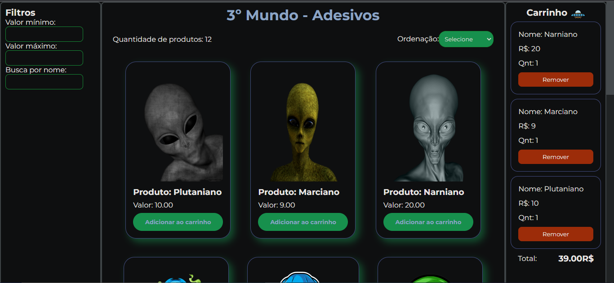
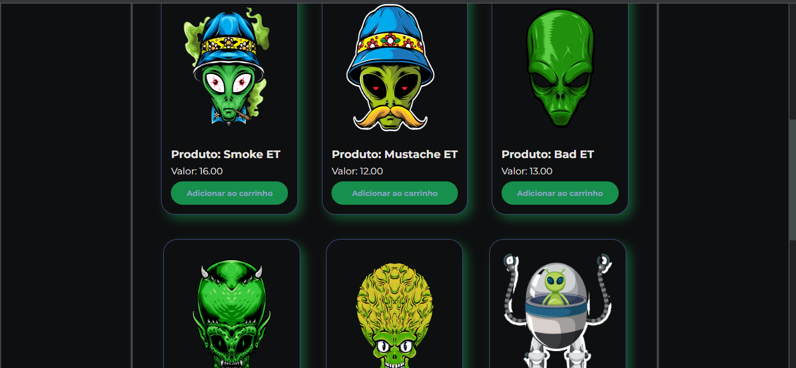
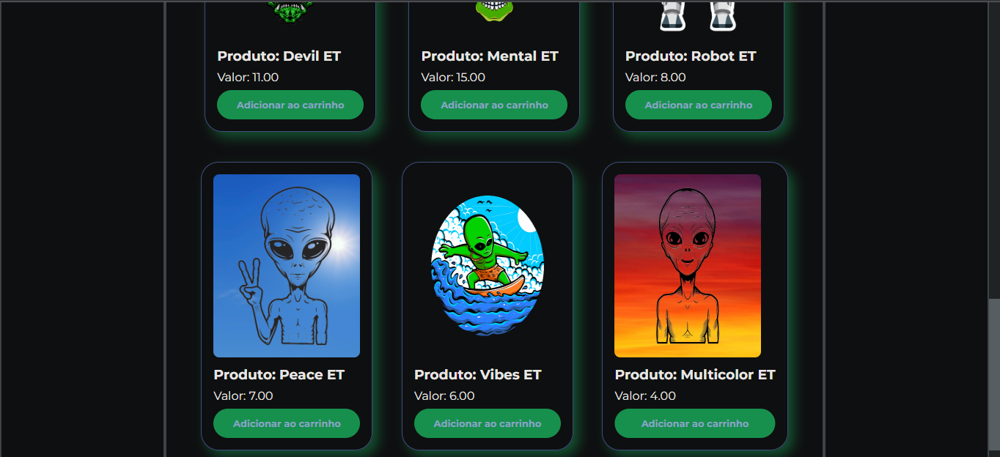

- E-Commerce de Adesivos de Extraterrestres -

Este projeto é um e-commerce que vende adesivos de extraterrestres. O objetivo é construir o front-end utilizando os fundamentos do React. Abaixo estão os requisitos e instruções para a elaboração do projeto:

Requisitos
O projeto consiste em três grandes partes:

Home:

Mostrar todos os produtos;
Possibilidade de ordenar os produtos por preço crescente ou decrescente;
Os produtos devem ter um botão para adicionar ao carrinho;
Exibir nome, preço e imagem de cada produto em um card.
Carrinho:

Mostrar todos os produtos adicionados;
Capacidade de remover itens do carrinho;
Exibir o valor total do carrinho.
Filtro:

Filtrar os produtos por valor mínimo e máximo;
Filtrar os produtos por nome.

Lista de Requisitos

Home (Lista de Produtos):
O usuário deve ser capaz de visualizar uma lista de produtos;
O usuário deve ser capaz de visualizar os dados do produto (nome, preço e imagem);
O usuário deve ser capaz de adicionar um produto ao carrinho.

Carrinho:
O usuário deve ser capaz de visualizar os produtos adicionados;
O usuário deve ser capaz de visualizar a quantidade correta de cada produto;
O usuário deve ser capaz de remover itens do carrinho;
O usuário deve ser capaz de ver corretamente o valor total da compra;
Os itens no carrinho devem permanecer mesmo após a atualização da página.

Filtros e Ordenação:
O usuário deve ser capaz de filtrar os itens por preço mínimo;
O usuário deve ser capaz de filtrar os itens por preço máximo;
O usuário deve ser capaz de realizar uma busca por nome;
O usuário deve ser capaz de ordenar os itens em ordem crescente ou decrescente;
O usuário deve ser capaz de aplicar filtros, busca e ordenação simultaneamente;
O usuário deve ser capaz de retornar à visualização sem filtros.

Link para o projeto: https://terceiromundoadesivos.surge.sh/

